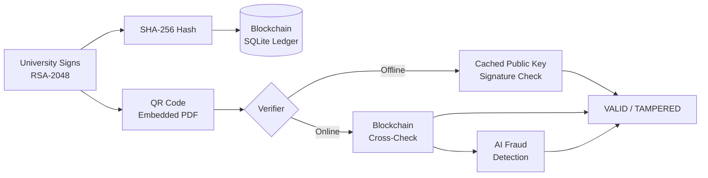

# Certificate Validator

> **Offline-first, cryptographically signed academic credentials — with fraud detection, blockchain anchoring, and a digital skill passport.**

<!-- SCREENSHOT: home page hero -->

---

## The Problem

Credential fraud — forged degrees, tampered transcripts, fabricated certificates — is a $1 billion global problem. Degree mills sell authentic-looking diplomas; manual verification is slow, expensive, and geographically uneven. In low-connectivity regions, employers or institutions that need to verify a candidate''s qualification often cannot reach a central verification portal at all — leaving them with no reliable fallback other than trusting the paper in their hand.

## The Solution

Certificate Validator replaces trust-in-paper with cryptographic proof. Universities sign each certificate with an **RSA-2048 private key**, embed the signature and metadata in a **QR code**, and anchor a SHA-256 hash to a **simulated blockchain ledger**. Any verifier — employer, institution, or person — can scan the QR and verify the signature **entirely offline**, with no server call required, using a cached or freshly-fetched public key. For additional assurance, an **8-point AI fraud-detection pipeline** cross-checks metadata consistency and surfaced anomalies. Students get a **Digital Skill Passport** (shareable portfolio + verified credentials) and a **Credential Wallet**. All events are recorded in a tamper-evident **audit log**. The full flow works from issuance to verification in under 60 seconds.

---

## Architecture

### Issuance Flow

```
University Portal
      |
      v
 Issue Certificate
 (student data + CGPA + dates)
      |
      v
 Sign payload with RSA-2048
 Private Key (university-held)
      |
      +-->  SHA-256 Hash --> Blockchain Anchor
      |         (SQLite ledger, Polygon-ready interface)
      |
      +-->  QR Code (base64 JSON payload: data + signature + issuer_id)
                  |
                  v
           Embedded in Certificate PDF
           (downloadable, printable, shareable)
```

### Verification Flow

```
QR Code / Certificate ID
      |
      v
 Decode QR payload
      |
      +-- Offline path -->  Fetch or use cached RSA Public Key
      |                        |
      |                        v
      |                   Verify RSA Signature (no server needed)
      |                        |
      |                        v
      |                   OK VALID  or  X TAMPERED
      |
      +-- Online path  -->  Cross-check against blockchain anchor
                               |
                               v
                          Optional AI Fraud Analysis
                          (8-point heuristic + real LLM if configured)
```



---

## Tech Stack

| Layer | Technology |
|---|---|
| **Frontend** | React 19 + Vite, Framer Motion, Recharts, jsPDF, html2canvas |
| **Backend** | Node.js 18+, Express 5, better-sqlite3 (SQLite) |
| **Cryptography** | Node.js `crypto` (RSA-2048 + SHA-256), offline signature verification |
| **AI / Fraud Detection** | Multi-provider LLM abstraction (OpenAI / Gemini / Claude / Azure / Heuristic fallback) |
| **Blockchain** | Simulated SQLite ledger — identical interface to an on-chain contract; Polygon-ready |
| **Auth** | JWT (jsonwebtoken) + bcryptjs |
| **QR** | `qrcode` library — base64 JSON payload embedded in certificate |
| **Design System** | Monochrome "Crest" design system, Framer Motion reveal/draw-in motion primitives |

---

## Quick Start

### Prerequisites
- Node.js 18 or higher
- npm 9 or higher

### 1. Clone the repository
```bash
git clone https://github.com/your-repo/Certificate_Validator.git
cd Certificate_Validator
```

### 2. Install dependencies
```bash
# Backend
cd backend && npm install

# Frontend
cd ../frontend && npm install
```

### 3. Configure environment variables
```bash
# Backend - required
cd backend
cp .env.example .env
# Edit .env: set JWT_SECRET to any long random string
# Optionally set AI_PROVIDER=gemini and GEMINI_API_KEY=... for real LLM responses

# Frontend - no variables required for local development
```

**Minimum required `.env` for the backend:**
```env
PORT=5000
JWT_SECRET=any_long_random_string_here_minimum_32_chars
DB_PATH=./database.sqlite
AI_PROVIDER=heuristic   # works out of the box, no API key needed
```

### 4. Run locally
Open two terminals:

```bash
# Terminal 1 - Backend
cd backend && npm run dev
# Server starts at http://localhost:5000

# Terminal 2 - Frontend
cd frontend && npm run dev
# App opens at http://localhost:5173
```

### 5. First-time setup
1. Navigate to `http://localhost:5173`
2. Register as a **University** — generates your RSA-2048 key pair automatically
3. Register as a **Student** linked to that university
4. Issue a certificate from the University Dashboard
5. Verify it from the Verifier page — works offline after the first public key fetch

---

## Known Limitations & Roadmap

These are explicit design decisions, not hidden gaps. They reflect prioritization within hackathon constraints.

### Blockchain Layer — Simulated Ledger

The blockchain module (`backend/utils/blockchain.js`, `blockchainController.js`) uses a **SQLite-backed ledger** that mirrors the interface of a deployed smart contract. The data model, API surface, and frontend Blockchain Explorer are production-correct.

**Migration path to mainnet:** Swap `blockchain.js` for an `ethers.js` provider pointing at a Polygon/Ethereum node. No other file changes required — the controller and frontend consume the same interface. This was a deliberate time trade-off: a correct data model over a testnet integration.

### AI Layer — Heuristic Default

When `AI_PROVIDER=heuristic` (the default), the chat assistant and fraud-risk scorer use a fully-offline rule-based engine — no API key or network call required. This makes the system usable in air-gapped or low-connectivity deployments.

**Plugging in a real LLM:** Set `AI_PROVIDER=gemini` (or `openai`, `claude`, `azure`) and the matching API key in `.env`. Both the chat assistant and the 8-point fraud pipeline will call that provider, with automatic fallback to heuristic if the API call fails. The abstraction lives entirely in `backend/services/llmProvider.js` and `aiRiskScoringService.js`.

### Roadmap (post-hackathon)
- [ ] Deploy blockchain module to Polygon Mumbai testnet (single file swap)
- [ ] Employer-facing embeddable verification badge endpoint
- [ ] Mobile app (React Native) for QR scanning
- [ ] IPFS storage for certificate PDFs
- [ ] Multi-language support (i18n)

---

## Feature List by Role

### University
- Register with auto-generated RSA-2048 key pair
- Issue single or bulk (Excel upload) certificates
- View and manage all issued certificates
- Revoke certificates with reason tracking
- Certificate template preview for all 9 categories
- Analytics dashboard: issuance trends, department breakdowns, revocation rates
- Verification analytics: usage patterns, auth events
- Audit log: full event history with filters, CSV export

### Student
- Register and link to issuing university
- View and download all certificates as PDF
- Credential Wallet: 3D-tilt card view, signature verification status
- Digital Skill Passport: bio, skills, projects, internships, publications, achievements, licenses
- Public shareable portfolio URL
- Analytics: credential overview, wallet activity

### Verifier (Public / Employer)
- Verify by Certificate ID or QR code scan
- Offline verification — works with no internet after first key fetch
- Revocation list sync for fully offline verification
- AI Fraud Detection: 8-point analysis with risk score and confidence rating
- AI chat assistant for verification guidance

### Public
- Home page with feature overview
- Blockchain Explorer: browse all anchored transactions, search by hash/cert ID
- Public Skill Passport: view any student''s shareable portfolio

---

## Screenshots

<!-- SCREENSHOT: home page hero -->

<!-- SCREENSHOT: university dashboard — certificate issuance -->

<!-- SCREENSHOT: verifier page — valid certificate result -->

<!-- SCREENSHOT: verifier page — AI fraud analysis modal -->

<!-- SCREENSHOT: blockchain explorer -->

<!-- SCREENSHOT: digital skill passport -->

<!-- SCREENSHOT: student credential wallet -->

<!-- SCREENSHOT: audit log with filters -->

---

## Project Structure

```
Certificate_Validator/
├── backend/
│   ├── controllers/     # Route handlers (auth, certs, verification, blockchain, AI...)
│   ├── routes/          # Express routers (13 route modules)
│   ├── services/        # Business logic (LLM, fraud detection, OCR, passport, templates)
│   ├── utils/           # Crypto, blockchain ledger, key cache, helpers
│   ├── uploads/         # Certificate PDFs, QR code images (gitignored)
│   ├── .env.example     # All required env vars documented
│   └── server.js        # Express entry point
│
├── frontend/
│   ├── src/
│   │   ├── pages/       # 18 page components
│   │   ├── components/  # Shared UI + motion primitives
│   │   ├── api/         # Axios client modules per domain
│   │   ├── hooks/       # useReveal (IntersectionObserver)
│   │   └── utils/       # Offline crypto, QR decoder, wallet store, key cache
│   ├── .env.example
│   └── vite.config.js
│
├── README.md            # You are here
└── DEMO_SCRIPT.md       # Live demo walkthrough (added in demo prep phase)
```

---

## License

MIT
