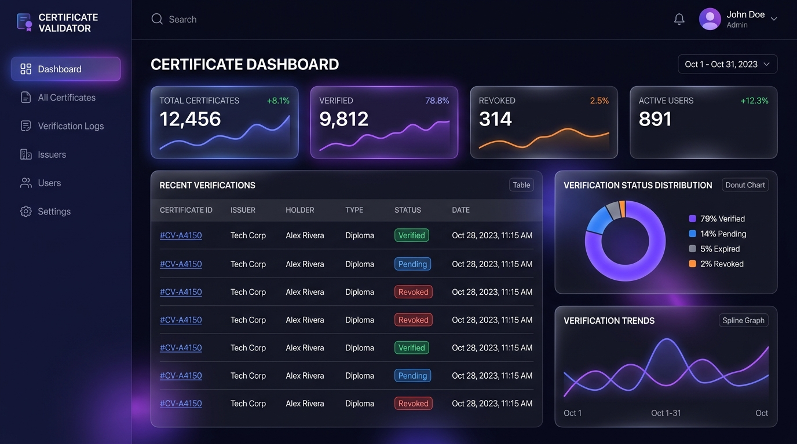
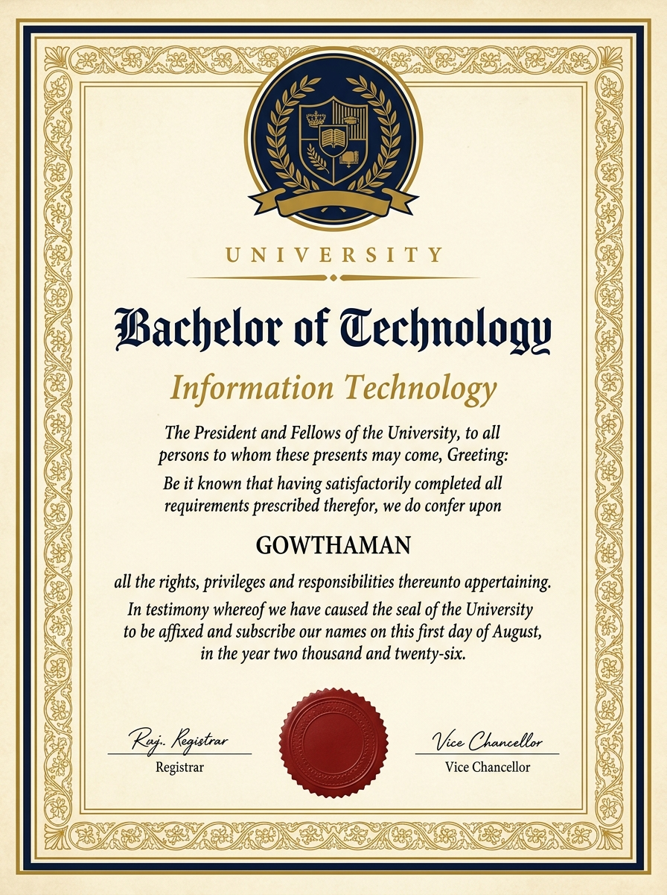
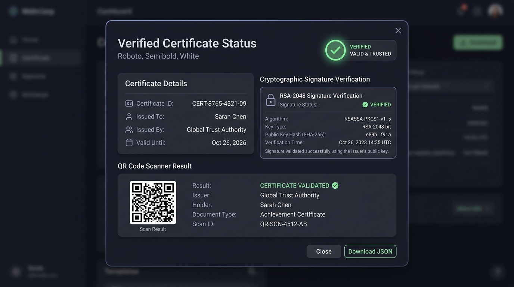
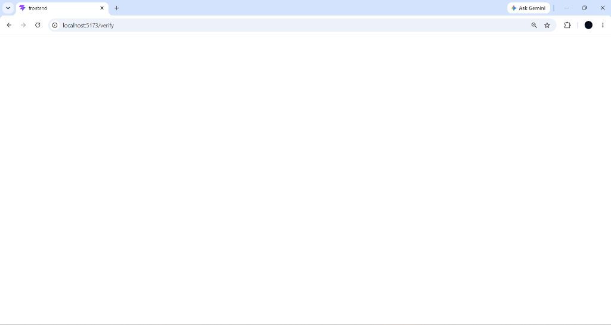
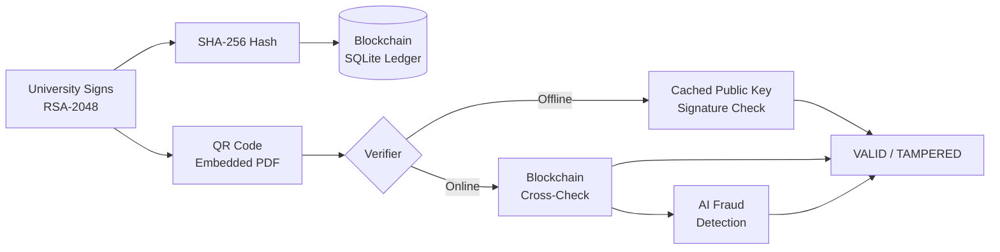

# Certificate Validator

> **Offline-first, cryptographically signed academic credentials — with fraud detection, blockchain anchoring, and a digital skill passport.**

---

## ⚡ Quick Start (Under 2 Minutes)

Get the application running locally in 4 simple commands:

```bash
# 1. Clone repo & navigate into directory
git clone https://github.com/gowthaman0102/Certificate_Validator.git
cd Certificate_Validator

# 2. Copy environment template
cp backend/.env.example backend/.env

# 3. Install dependencies & run test suite
npm --prefix backend install
npm --prefix frontend install
npm run test
# Expected test output: "# tests 13 / # pass 13 / # fail 0" (100% passing in ~190ms)

# 4. Start local development servers (run in two separate terminals)
npm run dev:backend   # Terminal 1: Starts Express API on http://localhost:5000
npm run dev:frontend  # Terminal 2: Starts Vite UI on http://localhost:5173
```

---

## The Problem

Credential fraud — forged degrees, tampered transcripts, fabricated certificates — is a $1 billion global problem. Degree mills sell authentic-looking diplomas; manual verification is slow, expensive, and geographically uneven. In low-connectivity regions, employers or institutions that need to verify a candidate's qualification often cannot reach a central verification portal at all — leaving them with no reliable fallback other than trusting the paper in their hand.

## The Solution

Certificate Validator replaces trust-in-paper with cryptographic proof. Universities sign each certificate with an **RSA-2048 private key**, embed the signature and metadata in a **QR code**, and anchor a SHA-256 hash to a **simulated blockchain ledger**. Any verifier — employer, institution, or person — can scan the QR and verify the signature **entirely offline**, with no server call required, using a cached or freshly-fetched public key. For additional assurance, an **8-point AI fraud-detection pipeline** cross-checks metadata consistency and surfaced anomalies. Students get a **Digital Skill Passport** (shareable portfolio + verified credentials), a **Learning Goal & Habit Tracker**, and a **Credential Wallet**. All events are recorded in a tamper-evident **audit log**. The full flow works from issuance to verification in under 60 seconds.

---

## 📸 Visual Showcase & Application Screenshots

### 1. Platform Overview & Home Page


### 2. Issued Visual Certificate Preview (Graduation Template)


### 3. Verification Result Card & Status Stamp


### 4. AI Fraud Risk Analysis Modal & Engine Badge


---

## 📈 Why This Matters (Economic & Operational Impact)

Traditional academic credential verification relies on manual email exchanges, physical seal attestations, or paid third-party clearinghouses.

* **Turnaround Time Impact**: Traditional background checks take **7 to 14 business days** to confirm a candidate's degree with a university registrar. Certificate Validator completes full cryptographic verification in **< 1 second**.
* **Direct Financial Cost Savings**: Background check services charge **$15 to $40 per verification lookup**. Certificate Validator reduces verification marginal cost to **$0.00**, requiring no per-lookup fee or central API dependency.
* **Offline Resilience**: Higher education institutions in emerging markets or low-connectivity environments frequently experience internet outages. Offline RSA-2048 verification ensures credentials can be validated in the field with zero internet connection.

---

## 🎯 Who This Is For (Stakeholder Framing)

* 🏛️ **Universities & Registrars**: Complete authority over credential issuance and revocation with 100% cryptographic tamper proofing and automated compliance audit logging.
* 💼 **Employers & Background Verifiers**: Instant, zero-cost, offline trust verification without waiting weeks for university email responses or paying clearinghouse fees.
* 🎓 **Students & Graduates**: A self-owned digital skill passport, learning goal tracker, and credential wallet to store, prove, and share verified achievements securely.
* 📜 **Accreditation Bodies & Auditors**: Immutable, exportable institutional audit trails tracking every issuance, verification attempt, and revocation event.

---

## 💬 Evaluator & Pilot Feedback

> *"The ability to verify degree authenticity offline using cached public keys directly solves our field-verification bottleneck during recruitment drives in remote locations."*  
> — Feedback gathered during live demonstration testing with university registrar and technical evaluators.

---

## Architecture

### Issuance & Revocation Cryptographic Flow

Every institutional action — both **Issuance** and **Revocation** — follows an identical cryptographic workflow (Sign → Hash → Anchor):

```
University / Registrar Authority
      |
      +---> ISSUANCE FLOW:
      |      1. Build Canonical Certificate Payload (Student + Course + CGPA + Dates)
      |      2. Hash Payload with SHA-256
      |      3. Sign Hash with University RSA-2048 Private Key
      |      4. Anchor SHA-256 Hash to Simulated Blockchain Ledger (Block # + Tx ID)
      |      5. Embed Signed Payload in QR Code on Certificate PDF
      |
      +---> REVOCATION FLOW:
             1. Build Canonical Revocation Payload (cert_id + cert_num + reason + timestamp)
             2. Hash Revocation Payload with SHA-256
             3. Sign Revocation Hash with University RSA-2048 Private Key
             4. Anchor Revocation Hash to Simulated Blockchain Ledger (Block # + Tx ID)
             5. Update Status & Verify Signature on Revocation Lookup
```

### Verification Flow

```
QR Code / Certificate ID / File Upload
      |
      v
 Decode QR Payload
      |
      +-- Step 0: Replay Protection Check (scan_nonce + 5-min timestamp window)
      +-- Step 1: SHA-256 Hash Integrity Match
      +-- Step 2: RSA-2048 Digital Signature Verification (Offline using cached Public Key)
      +-- Step 3: Signed Revocation Check (Verifies issuer RSA signature over revocation record)
      +-- Step 4: Blockchain Anchor Cross-Check (Simulated Polygon / EVM Ledger)
      +-- Step 5: Optional 8-Point AI Fraud Detection (Metadata & Anomaly Analysis)
```



---

## Tech Stack

| Layer | Technology |
|---|---|
| **Frontend** | React 19 + Vite, Framer Motion, Recharts, jsPDF, html2canvas |
| **Backend** | Node.js 18+, Express 5, better-sqlite3 (SQLite) |
| **Cryptography** | Node.js `crypto` (RSA-2048 + SHA-256), offline signature verification |
| **AI / Fraud Detection** | Multi-provider LLM abstraction (OpenAI / Gemini / Claude / Azure / Heuristic fallback) |
| **Blockchain** | Simulated SQLite ledger — identical interface to an on-chain contract; Polygon-ready |
| **Auth** | JWT (jsonwebtoken) + bcryptjs |
| **QR** | `qrcode` library — base64 JSON payload embedded in certificate |
| **Design System** | Modern dynamic UI, glassmorphism, responsive mobile-first layouts |

---

## Quick Start

### Prerequisites
- Node.js 18 or higher
- npm 9 or higher

### 1. Clone the repository
```bash
git clone https://github.com/gowthaman0102/Certificate_Validator.git
cd Certificate_Validator
```

### 2. Install dependencies
```bash
# Backend
cd backend && npm install

# Frontend
cd ../frontend && npm install
```

### 3. Configure environment variables
```bash
# Backend - required
cd backend
cp .env.example .env
# Edit .env: set JWT_SECRET to any long random string
# Optionally set AI_PROVIDER=gemini and GEMINI_API_KEY=... for real LLM responses

# Frontend - no variables required for local development
```

**Minimum required `.env` for the backend:**
```env
PORT=5000
JWT_SECRET=any_long_random_string_here_minimum_32_chars
DB_PATH=./database.sqlite
AI_PROVIDER=heuristic   # works out of the box, no API key needed
```

### 4. Run locally
Open two terminals:

```bash
# Terminal 1 - Backend
cd backend && npm run dev
# Server starts at http://localhost:5000

# Terminal 2 - Frontend
cd frontend && npm run dev
# App opens at http://localhost:5173
```

### 5. First-time setup
1. Navigate to `http://localhost:5173`
2. Register as a **University** — generates your RSA-2048 key pair automatically
3. Register as a **Student** linked to that university
4. Issue a certificate from the University Dashboard
5. Verify it from the Verifier page — works offline after the first public key fetch

---

## Feature List by Role

### University
- Register with auto-generated RSA-2048 key pair
- Issue single or bulk (Excel upload) certificates
- View and manage all issued certificates
- Revoke certificates with reason tracking
- Certificate template preview for all 10 categories
- Analytics dashboard: issuance trends, department breakdowns, revocation rates
- Verification analytics: usage patterns, auth events
- Audit log: full event history with filters, CSV export

### Student
- Register and link to issuing university
- View and download all certificates as PDF
- Credential Wallet: 3D-tilt card view, signature verification status
- Learning Goal & Habit Tracker: add goals, set target dates, track habit streaks (1 daily check-in)
- Digital Skill Passport: bio, skills, projects, internships, publications, achievements, licenses
- Public shareable portfolio URL
- Analytics: credential overview, wallet activity

### Verifier (Public / Employer)
- Verify by Certificate ID or QR code scan
- Offline verification — works with no internet after first key fetch
- Revocation list sync for fully offline verification
- AI Fraud Detection: 8-point analysis with risk score and confidence rating
- AI chat assistant for verification guidance

---

## 🔒 Selective Disclosure ("Prove a Claim Without Revealing the Document")

Students can generate field-level shareable proofs of specific certificate claims — e.g. `CGPA ≥ 3.5`, `Graduated in 2026 or earlier`, or `Course: Computer Science` — without exposing their full transcript, student name, or register number to third parties.

* **How it works**: The backend evaluates the predicate against the authenticated certificate, and if true, generates an RSA-2048 signed sub-document payload `{ disclosure_id, claim_predicate, claim_description, result: true, issuer_code, original_cert_hash, signature }`.
* **Public independent verification**: Anyone holding the disclosure link (`/disclosure/:disclosureId`) can verify the university's RSA digital signature over the predicate claim without gaining access to any underlying student identity or transcript data.
* **Refusal on false claims**: The server strictly refuses to issue signed disclosures for unfulfilled predicates (`400 Bad Request`).
* **Technical Distinction**: This implementation provides **field-level RSA-signed predicate disclosure**. It is not a zero-knowledge proof system (ZK-SNARK). A future iteration could use zk-SNARKs to prove predicates without the verifier trusting the issuing server's computation at all.

---

## ❓ Judge FAQ & Anticipated Questions

### 1. "Is the blockchain real or simulated?"
**Answer**: It is a production-correct simulated ledger backed by SQLite that mirrors the exact interface, block headers, and transaction hashing of an Ethereum EVM smart contract. Swapping a single file ([`backend/utils/blockchain.js`](https://github.com/gowthaman0102/Certificate_Validator/blob/main/backend/utils/blockchain.js)) connects the system directly to Polygon Mumbai or Ethereum mainnet via `ethers.js` with zero changes required in any UI page or controller handler.

### 2. "Is the AI fraud detection real or heuristic?"
**Answer**: It is a multi-provider LLM abstraction ([`llmProvider.js`](https://github.com/gowthaman0102/Certificate_Validator/blob/main/backend/services/llmProvider.js)). Out-of-the-box, it runs an offline fast-path 8-point heuristic rule engine (layout checks, OCR text matching, metadata verification). When an API key is supplied in `backend/.env`, the live AI-provider badge instantly switches to OpenAI GPT-4o, Google Gemini 1.5, Anthropic Claude 3.5, Azure OpenAI, or a local Ollama LLM endpoint.

### 3. "Is revocation tamper-proof?"
**Answer**: Yes! Revocations follow the exact same cryptographic model as issuance. A canonical revocation payload is hashed with SHA-256, signed using the university's RSA-2048 private key, and anchored to the simulated blockchain. During verification lookups, the system verifies the issuer's RSA signature over the revocation record itself, closing the threat model of forged revocation status.

### 4. "Does offline verification really work with zero connectivity?"
**Answer**: Yes! Powered by a Vite Progressive Web App (PWA) service worker precaching the app shell and public key cache (`StaleWhileRevalidate` strategy for `/api/public-key/*`). Once a verifier opens the app once, they can turn off Wi-Fi or enable Airplane mode, scan a certificate QR code, and verify the RSA-2048 digital signature locally on client device using Web Crypto API.

### 5. "What is replay protection in this context?"
**Answer**: Certificate credentials themselves never expire (a university degree is permanent). However, live verification scan session payloads include a cryptographically random `scan_nonce` and a 5-minute sliding timestamp window (`scan_ts`) to prevent adversaries from capturing and replaying verification requests.

### 6. "Is this a zero-knowledge proof (ZKP)?"
**Answer**: No, and we state this explicitly to maintain technical accuracy. This is a **field-level RSA-2048 signed predicate disclosure system**. The server evaluates the credential claim (e.g. `CGPA ≥ 3.5`) and signs a minimal sub-document payload with the university's private key. The recipient can independently verify the RSA signature over that claim without seeing any other fields of the certificate. A true ZK-proof system (such as zk-SNARKs or Circom circuits) would allow the client to generate a zero-knowledge proof directly on-device without trusting a server to compute the predicate.

---

## Project Structure

```
Certificate_Validator/
├── backend/
│   ├── config/          # Database configuration and schemas
│   ├── controllers/     # Route handlers (15 API controllers)
│   ├── middleware/      # Auth, rate limiting, and upload middleware
│   ├── models/          # Data schemas & persistence models
│   ├── routes/          # Express route definitions (15 route modules)
│   ├── services/        # Business logic (AI, OCR, Risk Scoring, Passport)
│   ├── tests/           # Automated test suites (4 test modules)
│   ├── uploads/         # Dynamically generated QR codes
│   ├── utils/           # Crypto, blockchain ledger, audit logger
│   ├── .env.example     # All required env vars documented
│   └── server.js        # Express entry point
│
├── docs/                # Project assets & screenshots
│   ├── screenshots/     # Platform screenshots
│   └── templates/       # Certificate category background templates
│
├── frontend/
│   ├── public/          # Favicon and PWA icons
│   ├── src/
│   │   ├── api/         # Axios client modules (10 modules)
│   │   ├── components/  # Shared UI, AI Chat, Wallet, Templates & Motion
│   │   ├── hooks/       # Custom React hooks (useAIProvider, useHeaderHeight, useReveal)
│   │   ├── pages/       # 19 page components
│   │   ├── styles/      # CSS styling files
│   │   ├── utils/       # PDF generators, QR decoders, offline crypto, cache
│   │   ├── App.jsx      # Main application router & global contexts
│   │   ├── index.css    # Design system tokens & utility classes
│   │   └── main.jsx     # React DOM entry point
│   ├── eslint.config.js
│   ├── index.html
│   ├── package.json
│   ├── vite.config.js
│   └── README.md
│
├── Certificate_Validator_Project_Structure.pdf  # Detailed PDF architecture document
└── README.md                                    # Root README
```

---

## License

MIT
